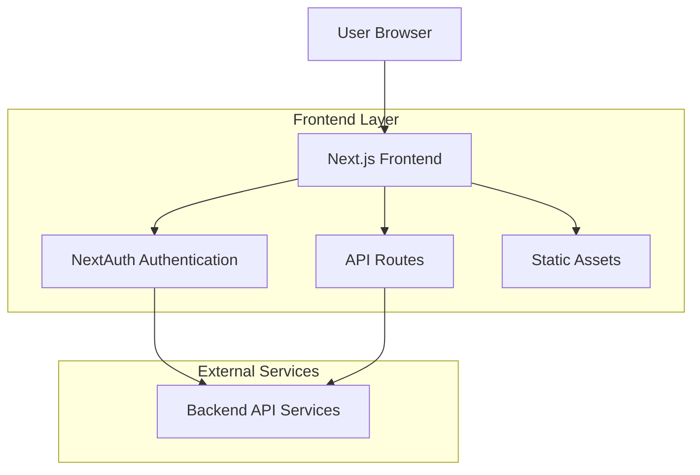
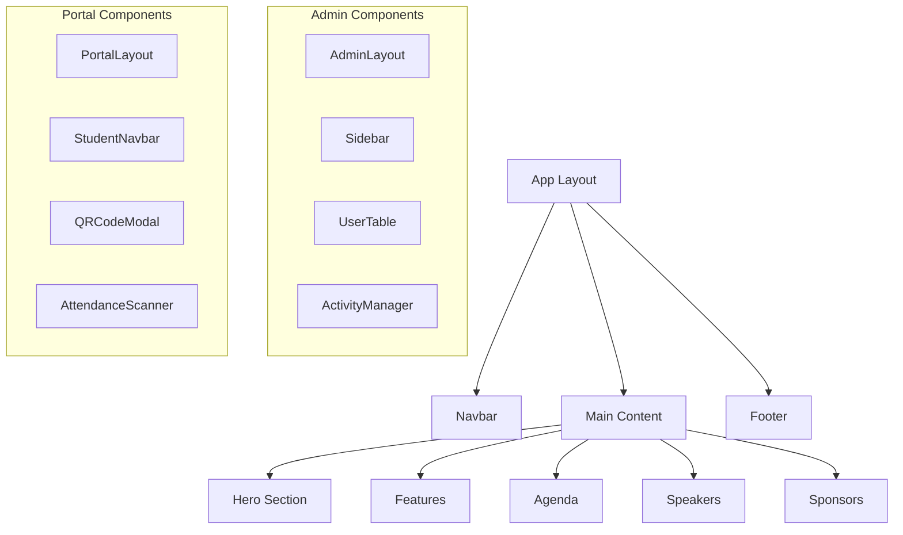

# Technical Architecture - Frontend Congreso Digital

## 1. Architecture Overview



## 2. Technology Stack

### Frontend Technologies

* **Framework**: Next.js 15.4.5 (React-based full-stack framework)

* **UI Library**: React 19.1.1

* **Styling**: TailwindCSS 4.x with PostCSS

* **Language**: TypeScript 5.x

* **Authentication**: NextAuth.js 4.24.11

* **Data Fetching**: SWR 2.2.5

* **UI Components**: Radix UI primitives

* **Icons**: Lucide React, Radix Icons

* **Charts**: ApexCharts with React ApexCharts

* **QR Code**: qrcode.react 4.2.0

* **QR Scanner**: qr-scanner 1.4.2

### Development Tools

* **Build Tool**: Vite (via Next.js)

* **Package Manager**: npm

* **Type Checking**: TypeScript

* **Linting**: Next.js built-in ESLint

* **Testing**: Playwright for accessibility testing

### Deployment Platform

* **Hosting**: Vercel

* **CDN**: Vercel Edge Network

* **Environment**: Node.js 18+

## 3. Route Architecture

### Public Routes

| Route          | Purpose                    | Features                         |
| -------------- | -------------------------- | -------------------------------- |
| `/`            | Landing page               | Hero, agenda, speakers, sponsors |
| `/expositores` | Speakers listing           | Speaker profiles and sessions    |
| `/agenda`      | Event schedule             | Timeline and activities          |
| `/faq`         | Frequently asked questions | Help section                     |

### Authentication Routes

| Route          | Purpose            | Protection          |
| -------------- | ------------------ | ------------------- |
| `/dashboard`   | User dashboard     | Authenticated users |
| `/mi-cuenta`   | User account       | Authenticated users |
| `/inscripcion` | Event registration | Authenticated users |

### Admin Routes

| Route                | Purpose              | Role Required |
| -------------------- | -------------------- | ------------- |
| `/admin/login`       | Admin authentication | Public        |
| `/admin`             | Admin dashboard      | Admin role    |
| `/admin/actividades` | Activity management  | Admin role    |
| `/admin/usuarios`    | User management      | Admin role    |
| `/admin/asistencia`  | Attendance tracking  | Admin role    |

### Portal Routes

| Route                       | Purpose               | Role Required |
| --------------------------- | --------------------- | ------------- |
| `/portal`                   | Student portal        | Student role  |
| `/portal/inscripciones`     | Student registrations | Student role  |
| `/portal/qr`                | QR code display       | Student role  |
| `/portal/marcar-asistencia` | Attendance marking    | Student role  |

### Staff Routes

| Route         | Purpose               | Role Required |
| ------------- | --------------------- | ------------- |
| `/staff`      | Staff dashboard       | Staff role    |
| `/staff/scan` | QR scanning interface | Staff role    |

## 4. Component Architecture

### Component Hierarchy



### Key Component Categories

#### Layout Components

* `Navbar.tsx` - Main navigation

* `Footer.tsx` - Site footer

* `AdminLayout.tsx` - Admin dashboard layout

* `PortalLayout.tsx` - Student portal layout

#### Feature Components

* `Hero.tsx` - Landing hero section

* `Agenda.tsx` - Event schedule display

* `Speakers.tsx` - Speaker showcase

* `QRScanner.tsx` - QR code scanning

* `ActivityManager.tsx` - Activity administration

#### UI Components

* `Button.tsx` - Reusable button component

* `Card.tsx` - Content cards

* `Dialog.tsx` - Modal dialogs

* `Table.tsx` - Data tables

* `Toast.tsx` - Notification system

## 5. State Management

### Authentication State

* **Provider**: NextAuth.js

* **Storage**: JWT tokens with session management

* **Context**: AuthContext for React components

### UI State

* **Toast Notifications**: ToastContext for global notifications

* **Loading States**: Component-level loading indicators

* **Modal State**: Dialog state management with Radix UI

### Data Fetching

* **SWR**: For client-side data fetching with caching

* **API Routes**: Next.js API routes for backend integration

* **Static Data**: JSON files for static content

## 6. API Integration

### API Route Structure

```
pages/api/
├── auth/           # Authentication endpoints
├── activities.ts  # Activity management
├── agenda.ts      # Schedule data
├── speakers.ts    # Speaker information
├── users/         # User management
└── certificates.ts # Certificate generation
```

### External API Integration

* **Backend API**: RESTful API integration

* **Authentication**: JWT-based authentication

* **File Upload**: Asset management for images and documents

## 7. Security Architecture

### Authentication Flow

1. User login via NextAuth.js
2. JWT token generation
3. Role-based access control (RBAC)
4. Protected routes with middleware

### Authorization Levels

* **Public**: No authentication required

* **Authenticated**: Basic user authentication

* **Student**: Student role required

* **Staff**: Staff role required

* **Admin**: Administrator role required

### Security Measures

* Environment variable protection

* Secure API endpoints

* Input validation and sanitization

* XSS protection with React

* CSRF protection with NextAuth.js

## 8. Performance Optimization

### Build Optimization

* **Static Generation**: Pre-rendered pages where possible

* **Image Optimization**: Next.js Image component

* **Code Splitting**: Automatic code splitting

* **Tree Shaking**: Dead code elimination

### Runtime Optimization

* **SWR Caching**: Intelligent data caching

* **Lazy Loading**: Component-level lazy loading

* **Bundle Analysis**: Build size monitoring

## 9. Development Workflow

### Local Development

```bash
npm run dev      # Start development server
npm run lint     # Code linting
npm run build    # Production build test
```

### Deployment Pipeline

1. Code changes pushed to GitHub
2. Vercel detects changes and builds
3. Automatic deployment to production
4. Environment variables injected securely

### Testing Strategy

* **Accessibility**: Playwright tests with axe-core

* **Linting**: ESLint for code quality

* **Type Checking**: TypeScript compiler

* **Build Validation**: Pre-build asset checking

## 10. Monitoring and Maintenance

### Analytics

* **Vercel Analytics**: Performance monitoring

* **Error Tracking**: Client-side error reporting

* **Usage Analytics**: User interaction tracking

### Maintenance

* **Dependency Updates**: Regular security updates

* **Performance Monitoring**: Build and runtime metrics

* **Security Audits**: Regular security assessments

